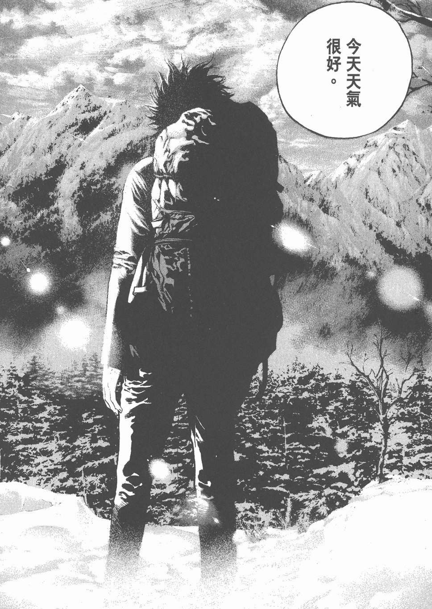
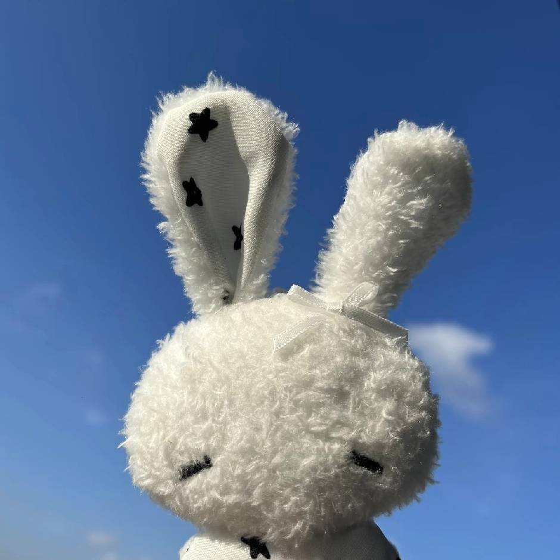
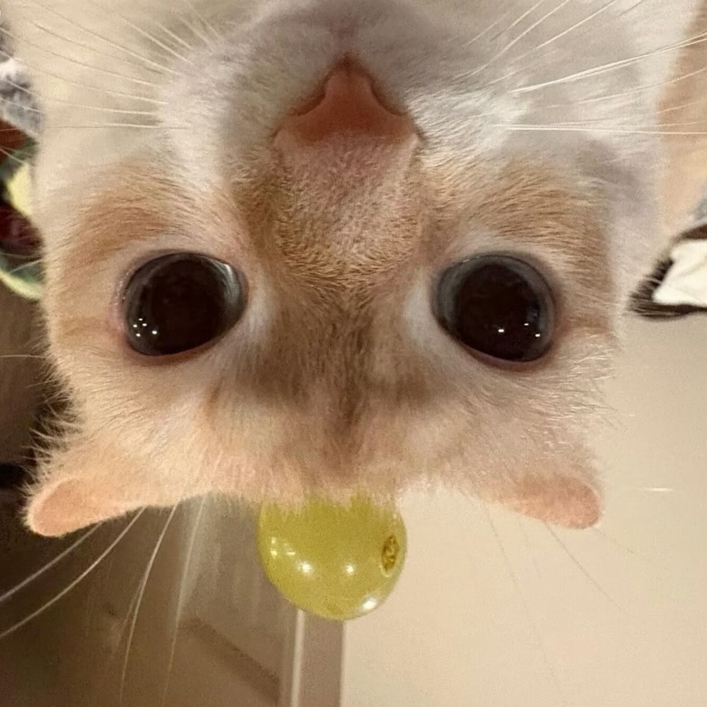

# CTRA@DGSSZ

东莞市第十三高级中学计算技术协会是由学生自行创立并运行的计算机技术研究社群，由Ye, Yougui老师指导。

同学们的兴趣非常广泛，从架子鼓到吉他、从信息学竞赛到程序设计、从各类传感小模块到各类创客比赛，再从网络安全到大模型； 如今，越来越多的青少年科技创新大赛中都能看到各位CTRAer们忙碌的身影。

我们希望有一个更开放的团体，实现我们“致力于打造一个热衷于技术研究与分享社群”的梦想，让这个梦想在这片贫瘠的土壤生长，让这片贫瘠的土壤变成创造的沃土，如果您与我们有着同样爱好与理想，欢迎联系我们！

> 微信公众号：十三中计协  
> E-Mail: opendgssz2025@outlook.com

 

# CTRAer

> As we do, as you know
>
> These are our members.

 

| | |
| --------------------------------------------------------- | ------------------------------------------------------------ | 
|   | **Ye, Yougui**(Advisor)  华南某211毕业的、HAM、摩托去西藏，同时也是计协最有影响力的任务（bushi - Blog: [https://XG2475.github.io/](//XG2475.github.io/) - Github: [XG2475](//github.com/XG2475) |
|   | **Zheng, Hailin**(Founder)  Security Researcher in Binary Security and AI Security - Blog: [https://blog.zer0ptr.icu/](//blog.zer0ptr.icu/) - Github: [zer0ptr](//github.com/zer0ptr)  - Class of 2024 |
|   | **Huang, Qingyi**  A java baby. - Blog: [https://colorfulbird3-blog.vercel.app/](//colorfulbird3-blog.vercel.app) - Github: [colorfulbird3](//github.com/colorfulbird3)  - Class of 2024|
|   | **Li, Runxuan**  无限进步 - Github: [RxuanLi](//github.com/RxuanLi)  - Class of 2024|
|  | **He, Caiyi**  前OIer  - Class of 2024 |
|  | **Zhou, Jiahui** 记得好像是对AI很感兴趣  - Github: [Z-jh07](//github.com/Z-jh07) - Class of 2024 |
|  | **Chen, Jialao** 前OIer，少女乐队重度患者  - Github: [Ak1yamaMi0](//github.com/Ak1yamaMi0) - Class of 2024 |
|  | **Fan, Cunzhen** 计协烤批，乌蒙大象痴，喜欢折腾BOT  - Github: [Ich1ka-chan](//github.com/Ich1ka-chan) - Class of 2024 |
|  | **Cheng, Junxiang**  或许精通欧洲的人文风情（  - Github: [Bingshui-bujia-bing](//github.com/Bingshui-bujia-bing) - Class of 2024 |
|  | **Huang, Haotong**  前OIer，打二游的  - Class of 2024 |
|  | **Yi, Zhehua**  该同学什么都没有留下  - Class of 2024 |
|  | **Huang, Runkai**  摄影大佬，计协CS打手  - Class of 2024 |
|  | **Xu, Ruize**  计协美工  - Class of 2024 |
|   | **Bai, Dongmin**(Leader, Class of 2025)  I wanna go to San Diego. - Github: [zmj8kk-white](///github.com/zmj8kk-white)  - Class of 2025|
|  | **Min, Zezheng**  𝓙𝓸𝔂 𝓲𝓷 𝓣𝓱𝓾𝓷𝓭𝓮𝓻 - Github: [zezhengmin](///github.com/zezhengmin)  - Class of 2025 |
|  | **Li, Guandong**  OI大佬，计协音乐人 - Github: [Fa2maZ](///github.com/Fa2maZ)  - Class of 2025 |
|  | **Lu, Zijun**  硬件安装、调试维修和java程序开发全能（bushi  - Class of 2025 |
|  | **Zhou, Yihu**  一个普普通通有Python基础的学子  - Class of 2025 |
|  | **Liu, Ruixiang**  前东华信奥班的，打球挺帅（  - Class of 2026 |

 

# Selected Awards

|                 Game Name                            |           Time            |
| ---------------------------------------------------- | ------------------------: |
| 东莞市东莞中学松山湖学校教育集团项目式学习（PBL）成果展评大赛一等奖🏆 | Onsite,June.2026 |
| 东莞市高中数学建模展评活动二等奖 | Online,Apr.2026 |
| 东莞市青少年科技创新大赛一等奖🏆 | Onsite,Dec.2025 |
| 东莞市人工智能与机器人主题活动·现场制作赛三等奖 | Onsite,Dec.2025 |
| 粤港澳信息学科技创新大赛（多人获）三等奖 | Onsite,Jun.2025 |
| 东莞市人工智能与机器人主题活动·现场制作赛三等奖 | Online,Dec.2024 |

> Fighting...